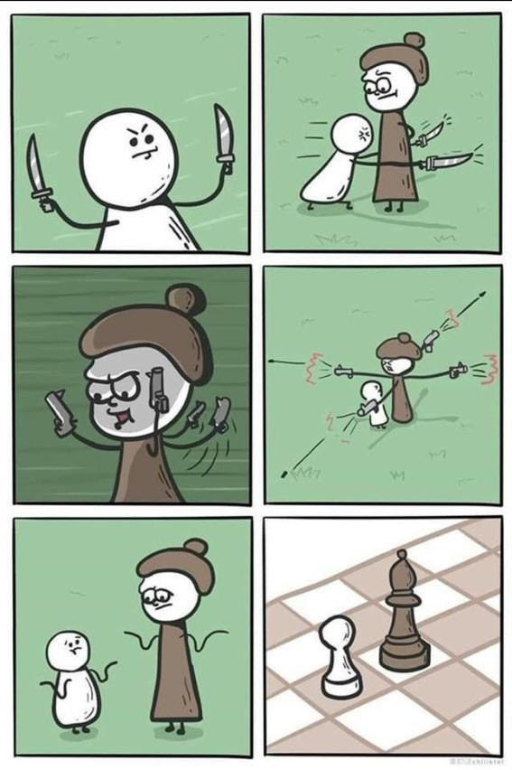

# Command Line Chess

This is a command line chess game that I made as part of learning Ruby using The Odin Project.

Instructions for the Project can be found here: https://www.theodinproject.com/lessons/ruby-ruby-final-project

